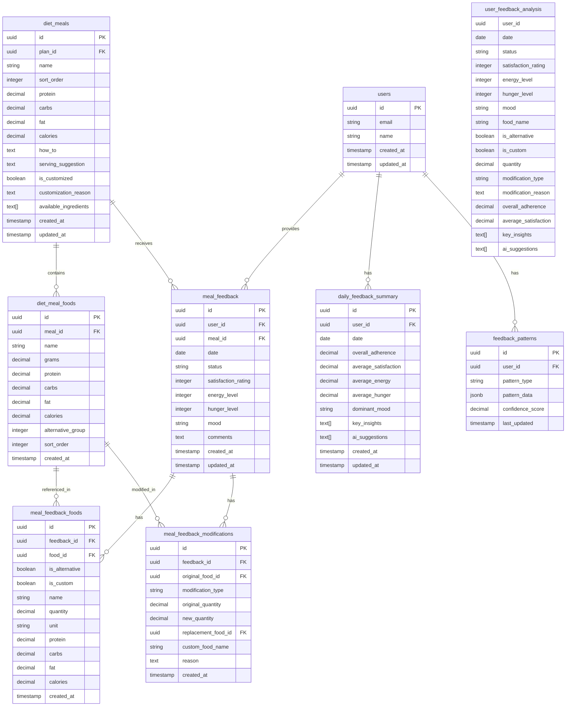

```mermaid
erDiagram
    %% Tabelas Existentes
    users {
        uuid id PK
        string email
        string name
        timestamp created_at
        timestamp updated_at
    }

    diet_meals {
        uuid id PK
        uuid plan_id FK
        string name
        integer sort_order
        decimal protein
        decimal carbs
        decimal fat
        decimal calories
        text how_to
        text serving_suggestion
        boolean is_customized
        text customization_reason
        text[] available_ingredients
        timestamp created_at
        timestamp updated_at
    }

    diet_meal_foods {
        uuid id PK
        uuid meal_id FK
        string name
        decimal grams
        decimal protein
        decimal carbs
        decimal fat
        decimal calories
        integer alternative_group
        integer sort_order
        timestamp created_at
    }

    %% Novas Tabelas de Feedback
    meal_feedback {
        uuid id PK
        uuid user_id FK
        uuid meal_id FK
        date date
        string status
        integer satisfaction_rating
        integer energy_level
        integer hunger_level
        string mood
        text comments
        timestamp created_at
        timestamp updated_at
    }

    meal_feedback_foods {
        uuid id PK
        uuid feedback_id FK
        uuid food_id FK
        boolean is_alternative
        boolean is_custom
        string name
        decimal quantity
        string unit
        decimal protein
        decimal carbs
        decimal fat
        decimal calories
        timestamp created_at
    }

    meal_feedback_modifications {
        uuid id PK
        uuid feedback_id FK
        uuid original_food_id FK
        string modification_type
        decimal original_quantity
        decimal new_quantity
        uuid replacement_food_id FK
        string custom_food_name
        text reason
        timestamp created_at
    }

    daily_feedback_summary {
        uuid id PK
        uuid user_id FK
        date date
        decimal overall_adherence
        decimal average_satisfaction
        decimal average_energy
        decimal average_hunger
        string dominant_mood
        text[] key_insights
        text[] ai_suggestions
        timestamp created_at
        timestamp updated_at
    }

    feedback_patterns {
        uuid id PK
        uuid user_id FK
        string pattern_type
        jsonb pattern_data
        decimal confidence_score
        timestamp last_updated
    }

    %% Relacionamentos Existentes
    diet_meals ||--o{ diet_meal_foods : "contains"

    %% Novos Relacionamentos
    users ||--o{ meal_feedback : "provides"
    diet_meals ||--o{ meal_feedback : "receives"
    meal_feedback ||--o{ meal_feedback_foods : "has"
    meal_feedback ||--o{ meal_feedback_modifications : "has"
    diet_meal_foods ||--o{ meal_feedback_foods : "referenced_in"
    diet_meal_foods ||--o{ meal_feedback_modifications : "modified_in"
    users ||--o{ daily_feedback_summary : "has"
    users ||--o{ feedback_patterns : "has"

    %% View Materializada
    user_feedback_analysis {
        uuid user_id
        date date
        string status
        integer satisfaction_rating
        integer energy_level
        integer hunger_level
        string mood
        string food_name
        boolean is_alternative
        boolean is_custom
        decimal quantity
        string modification_type
        text modification_reason
        decimal overall_adherence
        decimal average_satisfaction
        text[] key_insights
        text[] ai_suggestions
    }
``` 