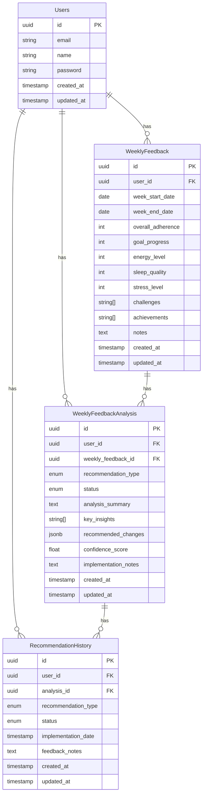

# Estrutura do Banco de Dados - Sistema de Feedback Semanal

## Diagrama ER

## Enums

### RecommendationType
- `maintain_plan`: Manter o plano atual
- `minor_adjustments`: Ajustes menores no plano
- `significant_changes`: Mudanças significativas no plano
- `complete_restructure`: Reestruturação completa do plano

### RecommendationStatus
- `pending`: Aguardando aprovação
- `approved`: Recomendação aprovada
- `rejected`: Recomendação rejeitada
- `implemented`: Recomendação implementada

## Tabelas

### Users
Armazena informações dos usuários.

### WeeklyFeedback
Armazena os feedbacks semanais dos usuários, incluindo métricas de aderência, progresso, níveis de energia, sono e estresse, além de desafios, conquistas e notas.

### WeeklyFeedbackAnalysis
Armazena as análises geradas pelo agente de IA para cada feedback semanal, incluindo o tipo de recomendação, status, resumo da análise, insights principais, mudanças recomendadas e score de confiança.

### RecommendationHistory
Armazena o histórico de recomendações, incluindo o tipo de recomendação, status, data de implementação e notas de feedback.

## Views Materializadas

### recommendation_analysis_history
View materializada que combina dados do histórico de recomendações com as análises de feedback, facilitando consultas de histórico.

## Índices

### WeeklyFeedbackAnalysis
- `IDX_weekly_feedback_analysis_user`: Índice no campo `user_id`
- `IDX_weekly_feedback_analysis_feedback`: Índice no campo `weekly_feedback_id`

### RecommendationHistory
- `IDX_recommendation_history_user`: Índice no campo `user_id`
- `IDX_recommendation_history_analysis`: Índice no campo `analysis_id`

### RecommendationAnalysisHistory
- `IDX_recommendation_analysis_history_user`: Índice no campo `user_id`
- `IDX_recommendation_analysis_history_analysis`: Índice no campo `analysis_id`

## Relacionamentos

- Um usuário pode ter vários feedbacks semanais
- Um usuário pode ter várias análises de feedback
- Um usuário pode ter várias recomendações no histórico
- Um feedback semanal pode ter várias análises
- Uma análise pode ter várias recomendações no histórico

## Constraints

### Chaves Primárias
- `PK_weekly_feedback_analysis`: Chave primária da tabela `weekly_feedback_analysis`
- `PK_recommendation_history`: Chave primária da tabela `recommendation_history`

### Chaves Estrangeiras
- `FK_weekly_feedback_analysis_user`: Relacionamento com a tabela `users`
- `FK_weekly_feedback_analysis_feedback`: Relacionamento com a tabela `weekly_feedback`
- `FK_recommendation_history_user`: Relacionamento com a tabela `users`
- `FK_recommendation_history_analysis`: Relacionamento com a tabela `weekly_feedback_analysis` 